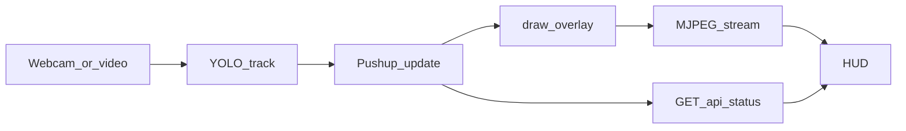

# ADIFORM — Push-up workout game

[](https://github.com/miergo/pose_estimation/actions/workflows/tests.yml)

**Try the UI:** [https://miergo.github.io/ADIFORM/](https://miergo.github.io/ADIFORM/)

That page is the interface you can click through (start, webcam or upload, rules, session HUD, scorecard). Pose tracking stays on your machine — the live page has no backend.

Local game: webcam or uploaded video → YOLO pose → live feed + HUD → scorecard.

Hold a plank to calibrate, then hit the depth bars. Score comes from depth and hip posture, not reps alone.

Frontend UI: https://www.figma.com/design/Ri4OqGX5ytMmzLzd3memo2/ADIFORM-2099?node-id=0-1&t=XhU66cCW2b0biesK-1

https://github.com/user-attachments/assets/0013b178-1ba9-439d-a410-03054ead9ecf

I can not screen record and let the app's YOLO model run because it renders very slowly and heats up my PC (my hardware cant do both things at once :( )

Backend Pose Tracker


https://github.com/user-attachments/assets/cd32ad41-a591-4dc4-9e52-ee24ef3ad7d9


## What you do

1. Choose **webcam** (timed or endless) or **upload** a video.
2. Hold an upward push-up so the app locks top and bottom bars.
3. After the countdown, do push-ups. The HUD shows reps, time, and score.
4. End the session for a short scorecard (hits, posture, total).

## How it works



One frame is captured, tracked, scored, then sent as MJPEG plus `/api/status` for the HUD.

- **Backend:** FastAPI runs one in-memory session. A worker thread reads frames, runs Ultralytics YOLO pose, updates a push-up tracker, draws overlays, and serves MJPEG + JSON status.
- **Frontend:** React (Vite) is a thin client: view state in `App.jsx`, polls `/api/status`, shows `/api/stream`.

No database, auth, or WebSockets — built to run on your machine.

## Requirements

- Python 3.11+ recommended
- Node.js 18+ (for the frontend)
- Webcam optional if you only upload video
- Model weights: `backend/model/yolo26n-pose.pt`

## Run locally

**Backend** (from `backend/`):

```bash
pip install -r requirements.txt
uvicorn server:app --reload --port 8000
```

**Frontend** (from `frontend/`):

```bash
npm install
npm run dev
```

Open [http://127.0.0.1:5173](http://127.0.0.1:5173). Vite proxies `/api` to the backend.

**Tests** (from `backend/`):

```bash
pytest
```

## API

| Method | Path | Purpose |
|--------|------|---------|
| `GET` | `/api/health` | Health check |
| `GET` | `/api/status` | Live session metrics |
| `GET` | `/api/stream` | MJPEG video stream |
| `POST` | `/api/start/webcam` | Start camera (`camera_id` form field) |
| `POST` | `/api/start/video` | Upload and play a video file |
| `POST` | `/api/go` | Leave ready → start counting |
| `POST` | `/api/stop` | Stop and return score summary |

## Project layout

```text
backend/
  server.py      # HTTP routes
  session.py     # Capture, YOLO, session thread, status
  pose.py        # Calibration, reps, scoring, overlays
  model/         # YOLO weights
  uploads/       # Uploaded videos (local)
frontend/
  src/App.jsx    # View state (no router)
  src/pages/     # Rules, session, ended
  src/components/
```

## Notes

- The [live UI](https://miergo.github.io/ADIFORM/) is for clicking through the screens. Scoring and the camera feed need the local backend.
- This is a **local** demo, not a hosted multi-user product.
- Pose model via [Ultralytics](https://github.com/ultralytics/ultralytics). Check their license for your use case.
- Ignore `frontend/src/archive/`, `backend/preview_pose.py`, and notebook experiments — they are not the live app.

## License

No license file yet. Default copyright applies (all rights reserved) until a license is added.

## Help

Open a GitHub issue in this repository if something is unclear or broken when running locally.
